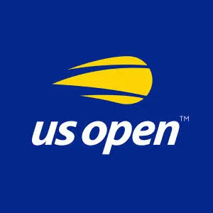

# 2026 US Open

A scroll-based visual story of the 2026 US Open Men's Singles Final.

<p align="center">
  <a href="https://www.usopen.org"></a>
  &nbsp;&nbsp;&nbsp;
  <a href="https://www.espn.com"></a>
  &nbsp;&nbsp;&nbsp;
  <a href="https://binary1702.com"></a>
</p>

## What This Is

An editorial web experience that tells the story of Alexander Zverev's victory over Ben Shelton in the 2026 US Open final. Built as a Binary 1702 experiment in data-driven storytelling.

## Sections

1. **Hero** - Champion reveal with embedded match footage
2. **Arthur Ashe** - History of the stadium and its namesake
3. **The Final** - Zverev vs Shelton head-to-head comparison
4. **Road to the Title** - Match-by-match journey through the tournament
5. **The Four Majors** - Context on Grand Slam tennis

## Stack

- Next.js 16
- TypeScript
- Tailwind CSS
- GSAP

## Data

Match data sourced from ESPN's API, stored in `lib/data/espn-us-open-2026.json`.

## Run Locally

```bash
npm install
npm run dev
```

## Credits

- **Data**: [ESPN](https://www.espn.com)
- **Tournament**: [US Open](https://www.usopen.org)
- **Built by**: [Binary 1702](https://binary1702.com)
